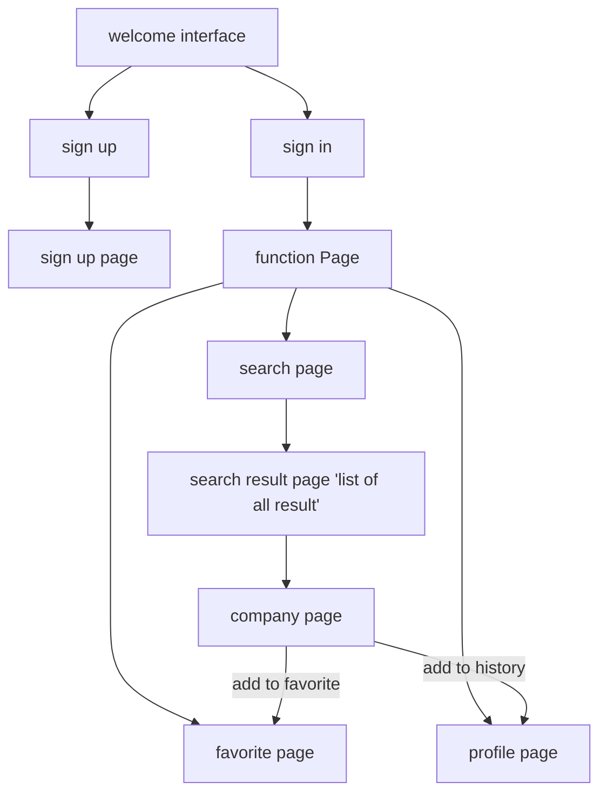

# App - ProCom Searcher
# Team name - CyberCom 2077
# Team structure and roles
* Chaofan Li u6803807 - team leader, document, UI design, create a user database, front and rear docking
* Yuliang Ma u6462980 - designer of data structure, searcher, sorting, promoting algorithm, tokenizer and parser, grammar, document, some UI works
* Yuchen Wang u6928271 - front and rear docking, searcher, tokenizer and parser, document, testing
# App OverView
This app is designed for people who keen on stocks. Through this app, you can find and search for profitable companies you like. Then you can use all the information about this company and decide whether to buy it or not.
The data was crawling from Eastern Fortune (a Chinese website which provides detailed information of all Chinese companies). 

But currently, the data we have is static, maybe in the future, we can add the web spider program in our app so that our users can refresh the data at any time.
## Features and Usage Instruction
At the front page, our users can log in to this app. If you haven’t registered before, you can click the signup button on the sign-up page.

You need to enter your account name, password, and you also need to select a hint question and corresponding answer to help you login in case you forget your password. Your information will be stored in a built-in database on your device. (We didn’t have enough time to use firebase, otherwise or the data will be stored in the Google database, so you can use this app on other devices by only sign-in).
After signing up, let’s go back to the front page.
If you forget your password, just click the “forget password”.

Then a dialog will popup:

This dialog includes questions you had selected when you sign-up. After answering this question, you have the authority to change your password. This new password will replace the old one and will be stored in the device's database.

If you just want to browse the content behind instead of signing in, you can just click “Enter without sign-in” at the bottom. However in this way you can only browse the information but not add the information to your favorite list or check your history list.

Okay, after passing the sign-in page (either through sign in or without sign in), you can see this main page of our app.

Begin with the top left corner:

You can see a mini keyboard. Tap it, you can see a drawer pop up. This drawer can help you enter query accurately and efficiently:

Then if you click the light bulb, a hint will pop up:

Through this hint, you can learn the general concept of our language, but we really recommend you to use Quick Input as we mentioned before.

Finally, let's query something!

Click this search box, you can see a history list (if you have used this app and searched something before):

You can also click Clear at the bottom to clean your search history(these histories are also stored in the database).
The yellow button above the search box stores the companies we recommend. If you click it, a short query sentence will be filled into the search box and search automatically. After you enter a query and click the search button or just click the big yellow button, a list of search results will be shown in front of you:

The order of this list is decided by the rank attribute you selected on the previous page, where you can find here:

The rank attributes are abbreviations of all the attributes a company has. After you choose an attribute you want to sort according to, the list in the result page will be sorted as you wish. 
Now let's have a look at the inside of a company. After you click each of the company, the company’s page will show up:

This page writes all the information about a company, including company name, stock number, and other information you may be interested in. 

You must see the star-like icon at the right top corner. Click it, this page will be stored in your favorite list. If you click it again, a dialog will show up:

You can decide whether to remove it from your favorites list or not.

You can check all your favorite companies on the favorite page (return to the third page and click the heart icon):
If you want to remove someone, just click the red cross button.

Finally, let’s go to the profile page (click the profile icon at the bottom):

You can see your username and your id, which is generated automatically. Your browser history is listed below, so you can check everything in it at any time. If you think these historical records are useless. Just tap the clear button to clean the history. The history is also stored in the device's database.

If you choose Enter without login at the front page, the favorite page and profile page will be shown like this :

By the way, you can also use this app in the landscape:

Above all are all the functions and interfaces of our app. Hope you enjoy it!

# Design Summary
## Grammer
 * LogicalExp1 ::= LogicalExp2 | LogicalExp2 OR LogicalExp1
 * LogicalExp2 ::= LogicalExp3 | LogicalExp3 AND LogicalExp2
 * LogicalExp3 ::= Exp  | NOT LogicalExp1 | (LogicalExp1)
 * Exp ::= Attribute = Double | Attribute > Double | Attribute < Double
## Parser
In the app, the user should use "&","|","!" to indicated "AND", "OR", "NOT". Only in the fourth rule, the Exp will be passed to the searcher to get an evaluated list of companies. Logical exps use the results to perform a logical operation to get a list. So every exp will have a list of evaluated qualified companies.
## Data Structure
There are 2 CSV resources in our app. The first CSV file stores companies' information, which includes companies' names, code, and other attributes. The second CSV file stores promoted companies' information, which decided every company's promoted power. 
In our data structure, we use 11 different BSTs to store companies' information according to their 11 different attributes. There is another BST used to store promoted companies' information. Each node in BST stores a list of companies' names, code as the value, and the corresponding attributes' value as its key.

The reason for choosing BST as the format of storing data is that we can perform sorting and sorting in a short time using the pre-order method in BST. We only create an object of the result after the result is got, we do that because we can save memory space and increase searching speed.  

Finally, we store the result in the SQL database to facilitate user-related functions.

# List of examples  
1.Example 1  
Tom wants to invest profitable companies, so he can directly use the "SEE THE MOST PROFITABLE COMPANIES NOW" button on the search page, it will auto input a query "((NPA>500)&(!(NPG<120)))&((TP>800)|(TOIG>170))".
The meaning of the query is that: Net profit amount is bigger than 500 million and Net profit growth is not lower than 120%, and either total profit is bigger than 800 or total operating income growth is bigger than 170%. Because investors tend to think that companies with very rapid business growth have have strong upward momentum.
One example in the real world picked out by this query is CODE 300888 in Chinese stock market, its price has increased by 50% after being picked out.

2.Example 2  
Sam doesn't wants to invest trash stocks to avoid losing money, so he can use our app to find those trash companies to prevent that situation. Trash stocks usually stands for declining profits in financial reports, so he can use query "(NPA<-50.2)&(NPG<-60)".
The meaning of the query is that: Net profit amount is lower than -50 million and net profit growth is lower than -60%. 
Using this query Sam can find many stocks whose names prefixed with ST, which means that those companies lose money for more than three consecutive years. 
# App Implemented Features
## Default Features:
1. (a) At least two app activities  
* We have 7 different pages, including 3 fragments.  
   (b) A visualization of the results retrieved by your search engine  
    i. A list of results for a given query 

    ii. Detailed view for each result (e.g. new views/activities)

2. Implemented Binary Search Tree and ArrayList for organizing, processing, retrieving and storing data. 
* Method initialDatabaseReader(), runDatabaseReader() of MainActivity_signin.
* Insert() and getpreorderList() method in BST.
* SetTreeByName() and GetTreeByName() method in DatabaseReader.
* SetDatabaseReader() and GetAllPromotedSortedList(), GetAllcomps(), Sortcompanies in Searcher.

3. Implemented a tokenizer and parser
* Tokenizer.java
* Parser.java
4. Using Bespoken to retrieve data from 2 local csv files
* Original_Database.csv
* Promoted_comps.csv
* Method iniDatabaseReader(), runDatabaseReader() of MainActivity_signin.
5. A data file with 4015 valid data instances
* Original_Database.csv
## Advanced Features

6. Apply linear and constraint layouts in different activities
* most of the layouts used constraint layout, such as layout/activity_user_profile.xml 
* linear layout is added to some nested layout, such as layout/company_item.xml
7. Support different screen sizes and orientation (portrait/landscape) 
* I hardly ever use the absolute constraint, and always use match parent to set the outer layout 
* I used create-landscape-variation to create another layout of the same page and reorganized the layout to make it look pretty
8. Using Bespoken to retrieve data from 2 local CSV files
* Original_Database.csv
* Promoted_comps.csv
* Method iniDatabaseReader(), runDatabaseReader() of MainActivity_signin.
9. -

10. Search functionality can handle partially valid and invalid search queries
* Unknowntype() of Token.class
* CheckBracketMatching(),Next() of Tokenizer.java
* Search() of Searcher.javaååå
* Parser.java
* Unknown_Exp.java
* UnknownRst.java
* ParseQuery(), Search() of SearchFragment.java
11. -

12. -
13. -

## Surprised Features
### Ranking algorithm
In the searching result page, we first rank the qualified promoted companies on the top according to their promoted power, then we show the un-promoted companies by ascending order according to a given attribute. This attribute can be selected on the searching page.

* GetAllPromotedSortedList(),GetAllcomps(),Sortcompanies() of Searcher.
* GetPreorderList()
* ParseQuery() of SearchFragment.java
### Promoted Items
In our current database, there are 40 promoted companies, every company has a promoted power in the range from 0 to 100. On the searching page, we have a scroll view showing these companies.
Besides, on the searching result page, we put qualified promoted companies on the top of the page, and there are flame icons set next to those promoted ones.
* Promoted_comps.csv
* IniDatabaseReader() 
* SetTreeByName() and GetTreeByName() method in DatabaseReader.
* GetAllPromotedSortedList(), SetDataBaseReader() of Searcher
* In the UI part, we use AutoPageUpLinearLayoutManager rewrite LinearLayoutManager class, achieved an auto-rolling list to present promoted companies.
## Functional design

## UML design
* historyUtil：

* layoutManagerTool：

* searcher:

* userDatabase:

* parser UML:

* data frame:

* tokenizer UML

* main UML：

## User database decision
At first, we thought we might use JSON file to write and read user data, but at last, we chose to use SQLite database, Because we can use SQL language directly to manipulate the data we stored, which is easy to understand and more advanced data manipulation such as join, insert, delete are easy to operate. But if we use to read and write files, maybe we need to read the whole file to find the target data. Besides the new version of the android studio also support a real-time database monitor, which makes it convenient for us to test whether our write and read functions works well.
We didn't consider firebase at first, but it is really a great tool to support users' registration and data storage. If we got more time, we will use that.

## Summary of errors
1. When you use the mouse wheel in the search interface, the automatic input method on the page will be automatically called.
2. In the landscape layout of the Searching Page, the list of quick input is incomplete.
# Testing summary
## Parser Test
I use one simple case "NPA=251" and one complex case "(NPA>5000)&(!(NPG<120.2))" to test parser.
Firstly I read in data from a CSV file and used Excel to get the correct result of the two queries. Secondly, I use an assertion to check whether the result is correct.

## Tokenizer Test
I use passcase1 "NPA>50.23", passcase2 "&|!<=" one complex case "(NPA>50.23)&(OE=28.3)|(NPG<100.1)" to test tokenizer.
Firstly I read in data from CSV file and used Excel to get the correct result of the two queries. Secondly, I go through passcase1 and passcase2 to check whether each token is recognized correctly. Finally, I use assertion to check whether the result is correct.

# Team meeting minutes
## Meeting 1
* meeting time: 9.8 11-13(AEST)
* content:
1. set topic of our app: Chinese Stock Search
2. set time table for the coming weeks:

	a. **break 1** discuss the requirements, think about the resource of data  
	b. **break 2** UI routine, data structure design, grammar design UI   
	c. **week 7** open a repo, set construction environment, begin to code;
		checkpoint: the UI design needs to be done，grammer need to be done  
	d. **week 8**  checkpoint: finish the main body, especially the search part, front end can obtain the data from the back end (through grammar and database)  
	e. **week 9**  refine the UI, fix some small bugs, begin to make  
	f.  **week 10**  prepare for the check by the tutor, begin to modify according to the bonus  
	g. **week 11** submit ppt and repo  
	h. **week 12** display and individual presentation  

## Meeting 2
* meeting time 9.14 
* content: 
1. ensure a name: ProCom Searcher（China）
2. discuss the UI's routine
3. discuss the data structure
4. job distribution:   
	Yuliang Ma (grammar)  
	Yuchen Wang (grammar, the connection between UI and grammar)  
	Chaofan Li：UI design, modify the user experience  

## Meeting 3
* meeting time: 10.3
* content:
1.  debug JSON
2. create searcher
3. create user interface:    
history, favorite, browse without sign in, user profile, write some test

## Meeting 4
* meeting time: 10.9
* content:
	new job assignment:
	Chaofan Li: connect interface and search grammar  
	Yuchen Wang: write a method which can return a line of result according to the company code  
	Yuliang Ma: manage decimal boundary value, achieve searching by negative values  

## Meeting 5
* meeting time:10.15
* content:
	new job assignment
	Chaofan Li: add sorted by button, which can sort the company list according to the attribute selected  
	Yuchen Wang: add a predefined condition, writing some test  
	Yuliang Ma: promote CSV, sort by the algorithm  

# Git commit history

# Statement of Originality
* statement-of-originality-u6462980
https://gitlab.cecs.anu.edu.au/u6803807/comp2100_6442_s2_2020_group_project/-/blob/master/statement-of-originality-u6462980.yml
* statement-of-originality-u6803807
https://gitlab.cecs.anu.edu.au/u6803807/comp2100_6442_s2_2020_group_project/-/blob/master/statement-of-originality-u6803807.yml
* statement-of-originality-u6928271
https://gitlab.cecs.anu.edu.au/u6803807/comp2100_6442_s2_2020_group_project/-/blob/master/statement-of-originality-u6928271.yml
